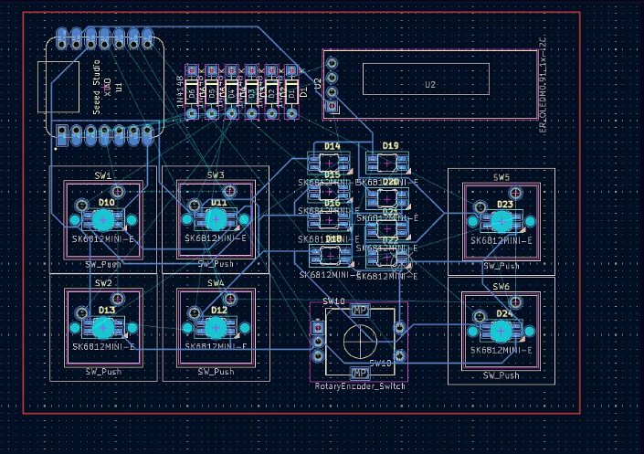
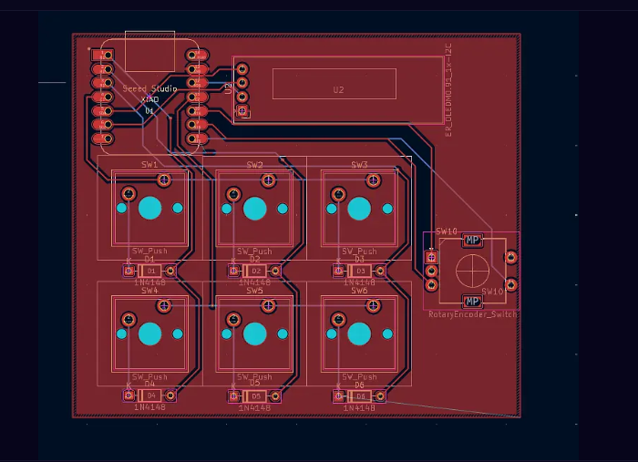
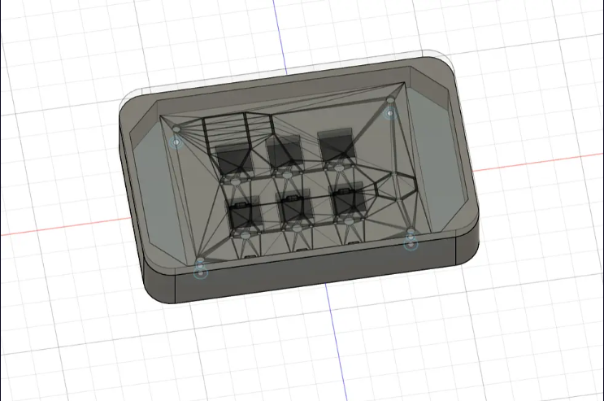

# June 12: Learning KiCad for PCB Designing

Started working on the PCB design for my custom HackPad.

Learning KiCad was harder than I expected, but the guides made the process much easier to follow. One thing that confused me was the guide mentioning a switch footprint from the care package. I couldn't find the exact footprint, so I used a similar switch footprint instead.

By the end of today's session I had almost completed the schematic and reached the PCB routing stage. I decided to stop there and continue later with a fresh mind instead of rushing through the routing.

**Total time spent: 4 hours**

# June 26: Progress on PCB Design

Finally finished the PCB!

This was much more frustrating than I expected. Three different times I completed almost the entire PCB, ran the DRC, and KiCad froze before closing without saving my work.

After rebuilding the design multiple times, I finally remembered to save before running DRC. Thankfully everything went smoothly after that and I completed the PCB.

Lesson learned: **Save before every DRC check.**

**Total time spent: 1 hours 50 minutes**

# June 27: Started Designing Enclosure

Started designing the enclosure for the HackPad.

Finding the correct dimensions for the switches, display, and other components took much longer than expected. Every enclosure project teaches me how much I still have to learn about CAD design.

One thing I realized is that I waste a Started Designing Enclosurlot of time stopping to measure parts while designing. Next time I'll note down every important dimension beforehand so I can stay focused throughout the design session.

**Total time spent: 1 hours 30 minutes**

# June 29: Done with Enclosure Design

Today I started enclosure design again and took reference designs and cad models help from grabcad and the help fom resources and guides of stardance.

**Total time spent: 4 hours**

# July 7: Update Repository with images files and journal 
 
Finally updated the repository with extra details in README.md .
Added Journals and did entry from Past devlogs from stardance.
Added images of designs.
**Total time spent: 2 hours**
